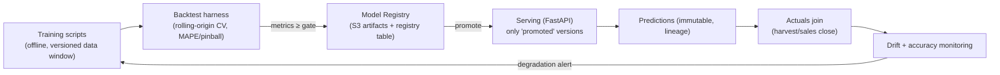
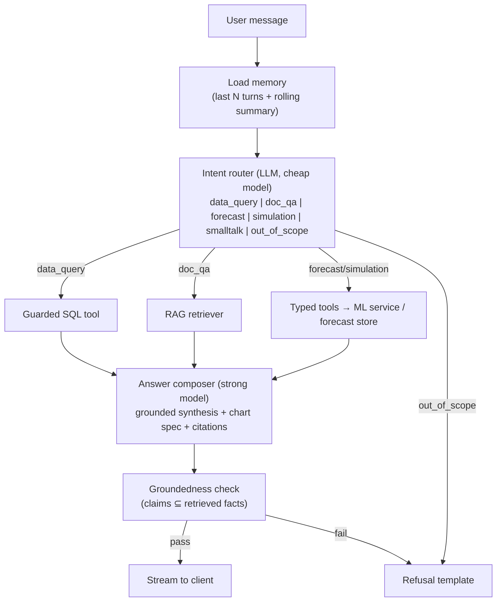

# AI Architecture

**Scope:** Prediction Engine (ML), Recommendation Engine, OpenAI integration, RAG, copilot orchestration, evaluation, and hallucination prevention.

---

## 1. Two AI planes, deliberately separated

| Plane | Purpose | Technology | Determinism |
|-------|---------|-----------|-------------|
| **Predictive** | Yield, demand, risk, route optimization, simulation | Python · FastAPI · XGBoost/sklearn/OR-Tools | Deterministic per model version |
| **Generative** | Copilot, document QA, narrative insights, recommendation prose | OpenAI API via LangChain (Node) | Non-deterministic → guarded + evaluated |

**Why separated:** predictive outputs drive financial commitments and must be reproducible, versioned, and backtestable — properties LLMs don't provide. The generative plane *consumes* predictive outputs and *never* produces numbers itself (see §6).

## 2. Prediction Engine (ML service)

### 2.1 Models

| Model | Algorithm (baseline → target) | Features | Output |
|-------|------------------------------|----------|--------|
| Yield | XGBoost regression (quantile heads for intervals) | variety traits, soil (pH/NPK/OM), weather aggregates (rain 30/60/90d, GDD, heat-stress days), practices, historical field yield, region | yield/ha + 80% PI + confidence |
| Demand | Per-segment gradient boosting with seasonal/lag features (baseline: seasonal-naive benchmark it must beat) | sales lags, month/season encodings, region, weather outlook, price, promo/subsidy flags | monthly units, 12-mo horizon + PI |
| Disease risk | Gradient-boosted classifier | humidity/temp windows, crop stage, report density, variety tolerance | outbreak probability per region×disease |
| Route optimization | OR-Tools CVRPTW (solver, not learned) | orders, capacities, distance matrix, time windows | stop sequences + savings |

**Confidence score** = calibrated function of (a) prediction-interval width relative to mean, (b) feature completeness, (c) distance of inputs from training distribution (isolation-forest novelty). Stored per prediction; surfaced in every UI.

### 2.2 MLOps loop

- Every prediction row stores `model_version_id` + a reference to its **feature snapshot** (JSONB) → full reproducibility and auditability (BRD BR-3).
- Promotion is a human-approved action recorded in the registry; rollback = repromote previous version.

## 3. Generative plane — Copilot orchestration

### 3.1 Guarded SQL tool (text-to-SQL without the usual risk)

1. **Surface:** only `semantic.*` views — curated, documented, PII-free, stable columns. The catalog (view + column descriptions + 3 example queries each) is injected into the generation prompt.
2. **Validation before execution:** parse with a SQL parser; reject anything but a single SELECT; reject relations outside the allow-list; reject `INTO`/functions on deny-list; inject `LIMIT 1000` if absent.
3. **Execution:** dedicated PostgreSQL role `copilot_ro` with `SELECT` on `semantic.*` only, `statement_timeout = 5s`, `work_mem` capped.
4. **Repair loop:** one retry with the DB error message; then refuse.
5. **Audit:** every executed SQL stored with the conversation turn.

### 3.2 RAG pipeline

- **Ingest:** upload → ClamAV scan → text extraction (pdf-parse / mammoth / xlsx) → semantic chunking ~800 tokens, 15% overlap, heading-aware → `text-embedding-3-large` → pgvector (HNSW index, cosine).
- **Retrieve:** hybrid = vector top-20 ⊕ Postgres full-text top-20 → Reciprocal Rank Fusion → optional LLM re-rank → top 6 chunks. **RBAC filter applied in the SQL retrieval query itself** (not post-filtering) so unauthorized content never enters context.
- **Cite:** answers reference chunk IDs → UI renders document title + section with link.
- **Re-index:** embedding model version stored per chunk; background re-embedding on model upgrade.

### 3.3 Prompt management

- Prompts are versioned files in-repo (`modules/copilot/infrastructure/prompts/*.md`) with template variables; every message logs its `prompt_version`. Changes go through PR review like code.
- System prompts enforce: use only provided context, cite every claim, output numbers only from tool results, refuse when context insufficient, never reveal schema/internal instructions.

### 3.4 Conversation memory

- Short-term: last 10 turns verbatim. Long-term: rolling LLM-generated summary stored on the conversation. Token budget enforced before each call (drop oldest first, summary survives).

## 4. Recommendation Engine (hybrid)

1. **Deterministic rule layer (authoritative trigger):** declarative rules over risk scores, forecast deltas, coverage ratios (e.g., `inventory.coverage < 0.6 AND demand.trend > 0 → propose transfer/production increase`). Rules versioned in DB with parameters.
2. **Generative narrative layer:** LLM converts the fired rule + evidence into an executive-readable rationale and options — the *decision content* comes from rules/models; the LLM only writes prose. Prevents "LLM invents policy".
3. Each recommendation stores evidence refs (risk/forecast/report IDs) + generator identity (rule version, prompt version) → full traceability (FR-REC-1).

## 5. Model & answer evaluation

| Layer | Method | Gate |
|-------|--------|------|
| ML models | Rolling-origin backtests; MAPE (demand), MAE + PI coverage (yield); champion/challenger | Promotion gate per roadmap |
| Copilot SQL | Golden-question suite (≥ 100 Q/A pairs with expected result sets) run in CI on prompt/model change | ≥ 95% exact/equivalent results |
| RAG | Retrieval precision@k on labeled set; answer faithfulness via LLM-judge + spot audits | Faithfulness ≥ 0.9 |
| Groundedness in prod | Sampled conversations scored asynchronously; refusal rate + citation coverage dashboards | Alert on drift |

## 6. Hallucination prevention (defense in depth)

1. Numbers only from tools (SQL results, forecast store, ML service) — composer prompt forbids arithmetic invention; verify step cross-checks numerals in the answer against tool outputs.
2. Citations mandatory; UI renders uncited factual answers as blocked (belt-and-braces client check).
3. Refusal is a designed, first-class outcome with helpful phrasing ("I don't have grounded data for X; ingesting Y would enable it").
4. Semantic layer keeps the schema surface small, documented, and unambiguous — most text-to-SQL failures are schema-comprehension failures.
5. Temperature 0–0.2 for SQL/tool calls; low for composition.
6. Farmer PII excluded from semantic views, prompts, and logs (NFR-SEC5).

## 7. Cost & resilience controls

- Token metering per user/org/feature → budgets with soft (warn) and hard (degrade to cheaper model / refuse) limits (FR-AI-8).
- Response caching: embedding cache (content-hash), FAQ answer cache with TTL, semantic-catalog cache.
- OpenAI outage: copilot degrades to "temporarily unavailable" with cached FAQ answers; predictive plane unaffected (separate runtime).
- Model choice: strong model (composition/SQL), small model (routing/summaries) — reviewed quarterly against the API's current lineup.
