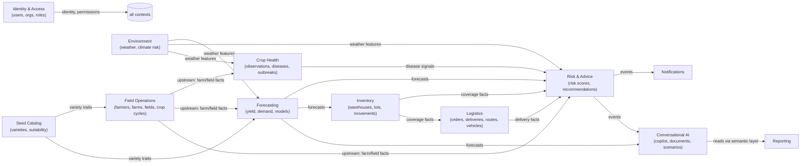

# Domain Model (DDD)

## 1. Bounded Contexts & Context Map

Relationships are **customer/supplier** with the arrow pointing downstream. Contexts communicate via domain events (in-process via outbox/queue) and read models — never by reaching into another context's tables directly.

## 2. Ubiquitous Language (canonical glossary)

| Term | Meaning | Owned by |
|------|---------|----------|
| Organization | Legal/business unit; tenancy boundary for data | IAM |
| Farmer | Registered grower supplying/purchasing from SeedCo | Field Ops |
| Farm | A farmer's landholding at a location | Field Ops |
| Field | Contiguous cultivated polygon within a farm | Field Ops |
| Crop Cycle | One variety planted on one field for one season | Field Ops |
| Variety | A catalogued seed product with agronomic traits | Catalog |
| Lot | Batch of seed with production date, expiry, germination test | Inventory |
| Stock Movement | Immutable ledger entry changing a warehouse balance | Inventory |
| Delivery | Fulfillment of an order via a routed vehicle trip | Logistics |
| Prediction | Immutable model output with confidence + lineage | Forecasting |
| Risk Score | Daily 0–100 per domain per scope | Risk & Advice |
| Recommendation | Prescriptive action with evidence + lifecycle | Risk & Advice |
| Scenario | Saved perturbation of baseline forecasts | Conversational AI |

## 3. Aggregates, Entities, Value Objects

Aggregate roots are the transactional consistency boundaries — repositories exist **only** for aggregate roots.

### Field Operations
- **Farmer** *(root)* — Entities: FarmerContact, ProductionRecord. VOs: NationalId, PhoneNumber, RiskScoreSnapshot. Invariants: unique NationalId/phone per org; risk snapshot immutable.
- **Farm** *(root)* — Entities: Field, SoilSample, FarmImage. VOs: GeoPoint, GeoPolygon, AreaHectares. Invariants: field polygons must fall within a bounding tolerance of the farm location; area derived, never user-set.
- **CropCycle** *(root)* — Entities: PracticeRecord, GrowthObservation. VOs: CropStage, HealthRating. Invariants: one *active* cycle per field per season; stage transitions monotonic (planned→planted→growing→harvested|failed); actual harvest requires `harvested` state.

### Crop Health
- **DiseaseReport** *(root)* — VOs: Severity(1–5), AffectedPercent. Status workflow reported→confirmed→treated→resolved; escalation is an event (`OutbreakCandidateDetected`), not a mutation of other reports.

### Inventory
- **Warehouse** *(root)* — VOs: Capacity, GeoPoint.
- **StockLot** *(root)* — VOs: ExpiryDate, GerminationResult.
- **StockLedger** *(root, per warehouse×lot)* — Entity: StockMovement (append-only). Invariant: **projected balance ≥ 0 enforced at movement append inside a serializable/`FOR UPDATE` transaction** — the single most important invariant in the inventory context.
- **Transfer** *(root)* — states pending→dispatched→received|cancelled; dispatch/receipt each append paired movements atomically.

### Logistics
- **Order** *(root)*, **Delivery** *(root)* — Delivery owns DeliveryEvents (timestamped status trail). **RoutePlan** *(root)* — Entities: RouteStop (ordered). Invariant: stop sequence unique & contiguous; total load ≤ vehicle capacity.

### Forecasting
- **PredictionRun** *(root)* — Entities: YieldPrediction / DemandForecast rows. VOs: ConfidenceScore(0–1), PredictionInterval, ModelVersion. Invariant: predictions immutable; corrections are new runs.
- **ModelVersion** *(root)* — lifecycle: trained→evaluated→promoted→retired; only `promoted` serves.

### Risk & Advice
- **RiskAssessment** *(root)* — VOs: RiskDomain, Score(0–100), FactorWeight[]. Daily grain per scope (org/region).
- **Recommendation** *(root)* — VOs: Urgency, EvidenceRef[]. Lifecycle proposed→accepted|dismissed→completed; every transition audited.

### Conversational AI
- **Conversation** *(root)* — Entities: Message (role, content, citations, executed SQL ref). **Document** *(root)* — Entities: DocumentChunk (text, embedding ref). **Scenario** *(root)* — VOs: ScenarioTemplate, ParameterSet; snapshot of baseline is embedded, making scenarios self-contained and immutable.

### Identity & Access
- **User** *(root)* — Entities: RefreshTokenFamily, MfaEnrollment. VOs: Email, PasswordHash. **Role** *(root)* — VO: Permission(`resource:action`). **Organization** *(root)* — Entities: Department.

## 4. Domain Events (canonical list, extensible)

| Event | Emitted by | Consumed by |
|-------|-----------|-------------|
| FarmerRegistered | Field Ops | Risk (initial score), Notifications |
| CropCycleStageChanged | Field Ops | Forecasting (re-score triggers) |
| DiseaseReportCreated / OutbreakCandidateDetected | Crop Health | Risk, Notifications, Recommendations |
| WeatherIngested / ClimateRiskComputed | Environment | Risk, Forecasting |
| StockMovementAppended / StockBelowCoverage | Inventory | Risk, Notifications, Recommendations |
| TransferDispatched / TransferReceived / TransferVarianceDetected | Inventory | Notifications |
| DeliveryStatusChanged / DeliveryFailed | Logistics | Notifications, Risk |
| PredictionRunCompleted | Forecasting | Risk, Recommendations, Dashboard refresh |
| RiskThresholdCrossed | Risk | Notifications, Recommendations |
| RecommendationProposed / RecommendationDecided | Risk & Advice | Notifications, Analytics |
| DocumentIndexed | Conversational AI | (search availability) |
| UserDeactivated | IAM | Session revocation |

Events are versioned (`eventVersion`), carry `occurredAt`, `correlationId`, and the aggregate ID; payloads contain IDs + minimal facts (consumers fetch what they need — avoids fat, coupling-prone events).

## 5. Policy: where logic lives

- **Entity/VO invariants** → domain layer constructors/methods (always-valid model).
- **Cross-aggregate rules** (outbreak clustering, stock coverage vs. forecast) → **domain services** invoked by application-layer use cases or event handlers.
- **Orchestration** (transactions, calling ML, sending notifications) → application layer.
- **Anything requiring I/O** → infrastructure adapters behind ports (interfaces defined in domain/application).
