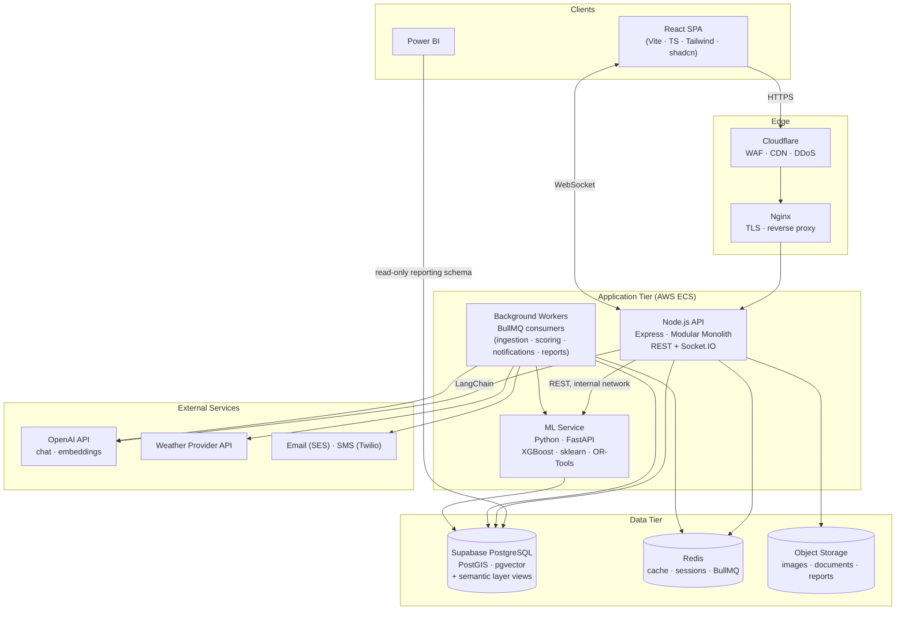
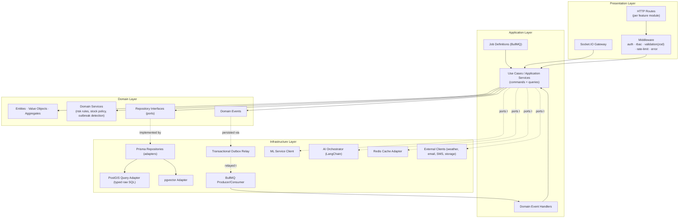
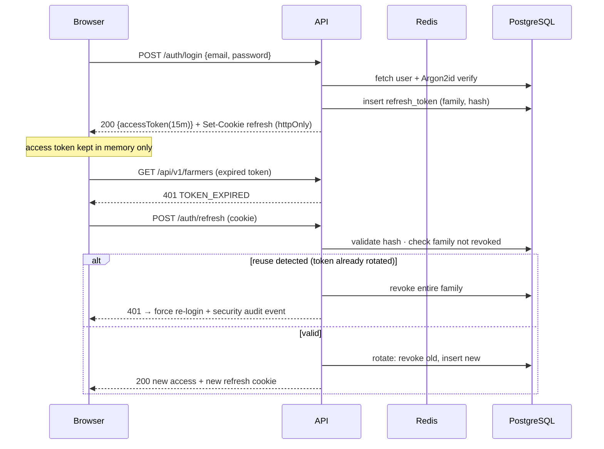
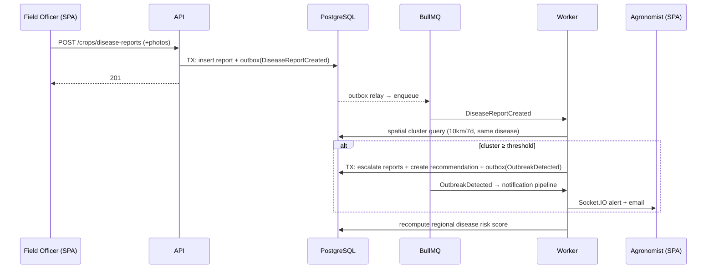
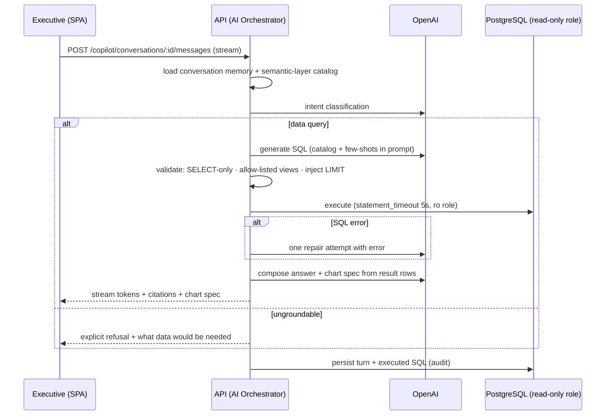
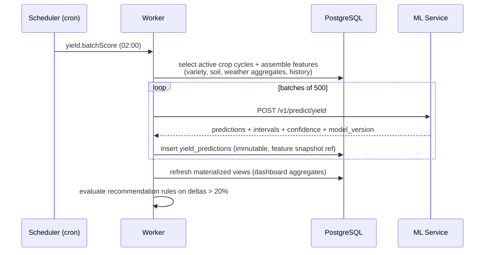
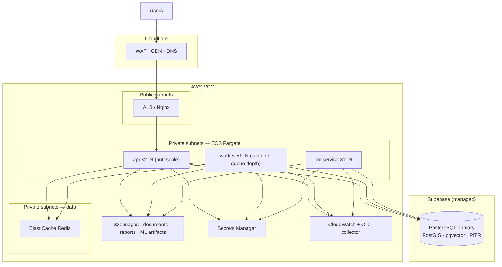

# System Architecture

**Version:** 1.0.0 · Diagrams in Mermaid (render on GitHub).

> **⚠ Amended by [ADR-0001](../adr/0001-python-backend-no-docker.md):** the backend is now a single **Python/FastAPI modular monolith** (absorbing the ML service into the same runtime), with **no Docker dependency** and **no Redis** (PostgreSQL-backed jobs replace BullMQ; in-process caches replace Redis cache). Read Node/Express/Redis/ECS references below through that lens; the module boundaries, Clean Architecture layering, outbox pattern, API contract, and data design are unchanged.

---

## 1. Architectural Style & Key Decisions

### AD-1: Modular Monolith API + one ML microservice (not full microservices)

**Options considered:**

| Option | Pros | Cons |
|--------|------|------|
| Full microservices (per module) | Independent scaling/deploys | 20 modules → enormous operational overhead for one team; distributed transactions across farmer/farm/inventory; premature |
| Single monolith incl. ML | One deployable | Python ML ecosystem doesn't fit Node runtime; ML resource profile (CPU/memory spikes) starves API |
| **Modular monolith (Node) + ML microservice (Python)** ✅ | Clean module boundaries with in-process calls; single DB transaction scope for business ops; ML isolated where the language/runtime boundary is real | Requires discipline (enforced by lint boundaries) |

The module boundaries follow DDD bounded contexts, so extraction to services later is a mechanical move, not a rewrite. **CQRS is applied selectively**: writes go through the domain layer; heavy reads (dashboard, GIS viewport, reporting) use dedicated read models (SQL views + materialized views) — full event-sourced CQRS would add complexity with no proportional benefit at this scale.

### AD-2: Event-driven internals via outbox + BullMQ

Domain events (e.g., `DiseaseReportConfirmed`, `StockBelowCoverage`) are written to an **outbox table in the same transaction** as the state change, then relayed to BullMQ. This guarantees no lost events (vs. publish-after-commit races) without introducing Kafka-class infrastructure prematurely.

### AD-3: Supabase PostgreSQL as the single system of record

PostGIS (geospatial), pgvector (embeddings), and relational data live in one database. This enables joins between embeddings/geo/business data (e.g., "chunks about drought near affected farms"), one backup story, and one transaction scope. Read scaling later via read replicas; the reporting/Power BI schema reads from views to keep that decoupled.

### AD-4: LangChain orchestration with guarded-SQL semantic layer

The copilot never touches raw tables. A curated set of `semantic.*` views (documented, stable, PII-free) is the only SQL surface; generation is validated (SELECT-only, allow-listed relations, LIMIT enforced) and executed under a read-only role. This converts "text-to-SQL hallucination risk" into a bounded, auditable capability.

---

## 2. System Architecture Diagram (C4: Container level)

**Notes:** Workers run the same codebase as the API in a separate process/task (different entrypoint) — one deploy artifact, independent scaling and failure isolation. The ML service is reachable only on the private network.

## 3. Component Diagram (API internal — Clean Architecture)

**Dependency rule (enforced by dependency-cruiser in CI):** `presentation → application → domain ← infrastructure`. The domain layer imports nothing from outer layers. Each of the 20 feature modules owns its slice of all four layers (feature-based folder structure — see folder-structure.md).

## 4. Sequence Diagrams

### 4.1 Authentication with refresh rotation

### 4.2 Disease report → outbreak alert (event-driven)

### 4.3 Copilot grounded data query

### 4.4 Nightly yield scoring

## 5. Deployment Diagram

Environments: **dev** (docker-compose, local Supabase or dev project) → **staging** (scaled-down mirror, anonymized data) → **production**. Web SPA is served as static assets from S3 + Cloudflare CDN; only `/api` and `/socket.io` hit the ALB. Socket.IO uses the Redis adapter so any API instance can deliver events (sticky sessions not required beyond the WS handshake).

## 6. Cross-Cutting Concerns

| Concern | Approach |
|---------|----------|
| Configuration | 12-factor env vars, validated at boot with Zod (`config` package); fail-fast on missing/invalid |
| Error handling | Central error taxonomy (`AppError` hierarchy: Validation, NotFound, Forbidden, Conflict, Domain, Infra); one Express error middleware maps to RFC 7807 problem+json |
| Idempotency | Mutating endpoints accept `Idempotency-Key`; workers use job IDs + upsert semantics |
| Caching | Redis: permission sets (60 s), weather responses (per grid-cell TTL), semantic-layer catalog, copilot embeddings of FAQs; explicit invalidation on writes |
| Realtime | Socket.IO namespaces per concern (`/alerts`, `/tracking`), JWT-authenticated handshake, room-per-user + room-per-role |
| Observability | OpenTelemetry SDK in API/workers/ML; trace context propagated over HTTP and job payloads |
| Migrations | Prisma Migrate; raw SQL migrations for PostGIS/pgvector/views/triggers checked into the same pipeline; roll-forward-only policy in prod |
