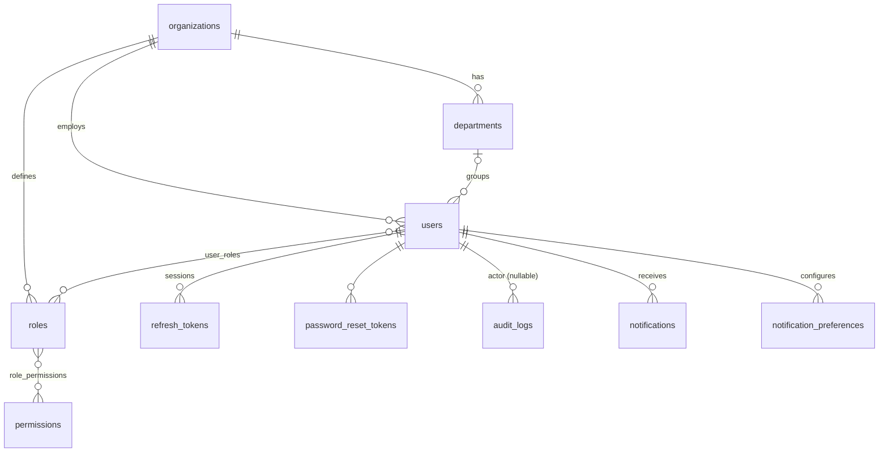
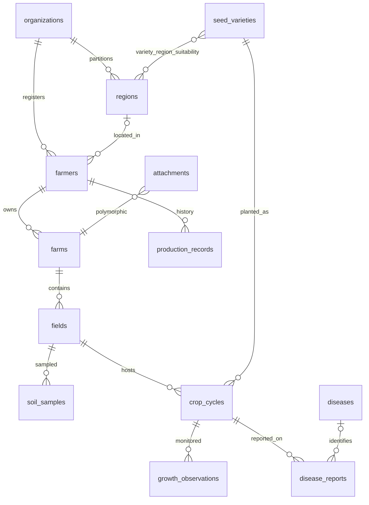
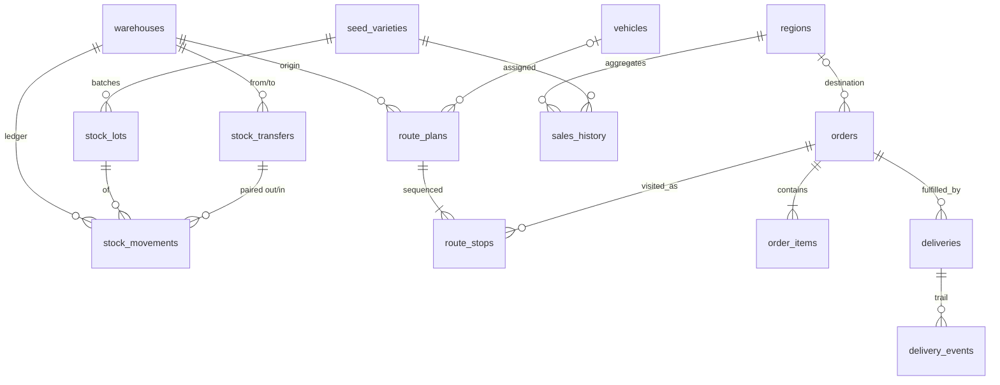
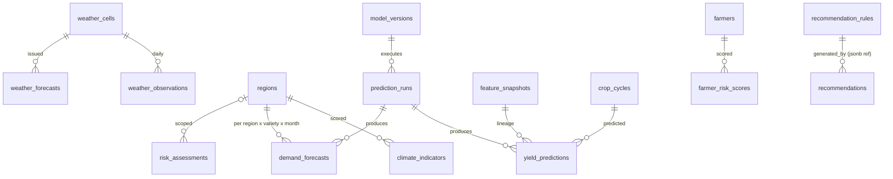
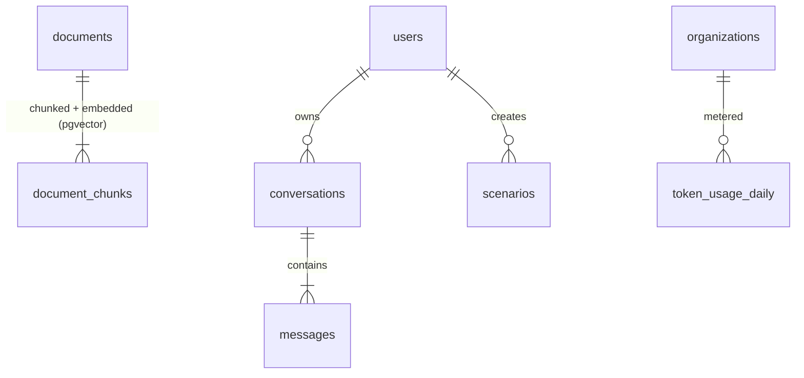

# ER Diagram

The full DDL is authoritative: [schema.sql](schema.sql). Diagrams below show relationships per context (a single diagram with 50+ tables is unreadable). Cardinality: `||` one, `o{` many-optional, `|{` many-required.

## 1. Identity & Access (`core`)

## 2. Field Operations (`ops`)

## 3. Inventory & Logistics (`ops`)

## 4. Intelligence (`intel`)

## 5. AI (`ai`)

## Design decisions worth noting

1. **Stock as ledger, not balance column.** `stock_movements` is append-only; `v_stock_balances` derives truth. Eliminates lost-update bugs, gives free audit history, and the trigger + `FOR UPDATE` pattern makes negative stock impossible (BR-2). Trade-off: balance reads aggregate — mitigated by the indexed view and, if volume demands later, an incrementally-maintained balance table fed by the same ledger.
2. **Predictions immutable with lineage** (`prediction_runs` → `model_versions`, `feature_snapshots`): BR-3 compliance; enables backtesting and "why did the number change" answers.
3. **Weather deduplicated by geohash-5 grid cells**: 50k farms collapse to a few hundred cells → bounded API cost and storage; farm→cell resolution is a spatial join at read time (GIST indexed).
4. **Partitioning:** `audit_logs` (monthly) and `weather_observations` (yearly) are range-partitioned — the two unbounded-growth tables (NFR-S2).
5. **Soft delete via `deleted_at` + partial unique indexes** so uniqueness applies only to live rows (e.g., re-registering a deleted farmer's phone works).
6. **`semantic` schema is a hard security boundary**: copilot's DB role can only see these PII-free views; PII protection is structural, not conventional.
