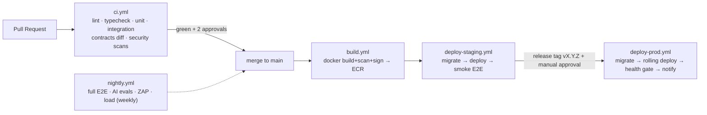

# CI/CD Pipeline

**Platform:** GitHub Actions · **Strategy:** trunk-based, staging on merge, production on approved release tag.

> **⚠ Amended by [ADR-0001](../adr/0001-python-backend-no-docker.md):** no Docker image builds/scans/signing — CI runs Python (ruff + pytest) and web (tsc + vite build) jobs on hosted runners; deploys ship a versioned artifact (wheel/tarball + static bundle) to the target host/PaaS instead of ECS. Turborepo is dropped with the Node backend; npm workspaces + pip caching keep PR feedback fast. The gating philosophy (required checks, environments, OIDC, approvals) is unchanged.

## 1. Pipeline map

## 2. `ci.yml` (every PR)

Jobs (parallel where independent; pnpm + turbo cache):

1. **lint-typecheck** — ESLint, Prettier check, `tsc -b`, dependency-cruiser boundary rules, ruff+mypy (`apps/ml` matrix leg).
2. **unit** — Vitest (api, web, packages) + pytest; coverage upload; gates enforced (85%/70%).
3. **integration** — Testcontainers services (postgres:15-postgis+pgvector image, redis:7); API route/RBAC/DB-invariant suites.
4. **contracts** — regenerate OpenAPI from `packages/contracts`; fail on undeclared breaking diff (`oasdiff`); schema snapshot check.
5. **security** — `pnpm audit` + `pip-audit` (fail on high), gitleaks (secrets), Trivy FS scan, CodeQL (weekly deep + PR incremental).
6. **build-check** — `turbo build` all apps (catches config/import breakage without publishing).

Concurrency group per-PR cancels superseded runs. Required checks: all of the above.

## 3. `build.yml` (merge to main)

- Multi-stage Docker builds (`apps/api`, `apps/ml`, web static bundle) — non-root, distroless/slim runtime stages.
- Tags: `sha-<short>` + `main`; Trivy image scan (fail high/critical); **cosign** sign; push to ECR. Web bundle → S3 (versioned prefix) with source maps to the error tracker only.

## 4. `deploy-staging.yml` (auto after build)

1. `prisma migrate deploy` + raw SQL migrations against staging (advisory-lock guarded so concurrent runs can't race).
2. ECS service update (api, worker, ml) with new image; wait for steady state.
3. Cloudflare cache purge for web bundle; health checks (`/health/ready` across services).
4. Playwright smoke suite against staging; failure → automatic rollback to previous task definition + Slack alert.

## 5. `deploy-prod.yml` (release tag, gated)

- Trigger: tag `v*` (created by release workflow with generated changelog from conventional commits).
- **Manual approval** via GitHub environment protection (2 reviewers: eng lead + product/ops).
- Steps: verify image signatures → DB migration (expand-only; contract migrations ship in a later release after code no longer references old shapes) → **rolling deploy** (min healthy 100%, one task at a time) → health gate (5 min error-rate + latency watch against baseline; auto-rollback on breach) → smoke tests → notify + create deployment record.
- Rollback: one-click workflow re-pointing services at the previous task definition; DB never rolled back (expand/contract discipline makes old code + new schema compatible).

## 6. `nightly.yml`

Full E2E matrix, AI eval suites (SQL golden set, groundedness, RAG precision), ZAP baseline against staging, dependency-update PRs (Renovate), Terraform drift detection; weekly k6 load run. Failures page the on-call channel.

## 7. Secrets & environments

GitHub Environments (`staging`, `production`) hold OIDC role ARNs only — **no long-lived AWS keys**; deploy jobs assume roles via OIDC. Application secrets live in AWS Secrets Manager, injected at task launch; CI never sees them. Branch protection: signed commits encouraged, linear history, no force push, required checks + 2 reviews.

## 8. Versioning & releases

Semantic versioning driven by conventional commits (release-please). Every production deploy records: version, image digests, migration IDs, deployer, approval trail — queryable for audits (maps to NFR/audit posture).
